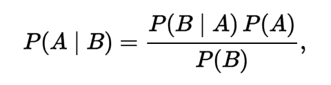
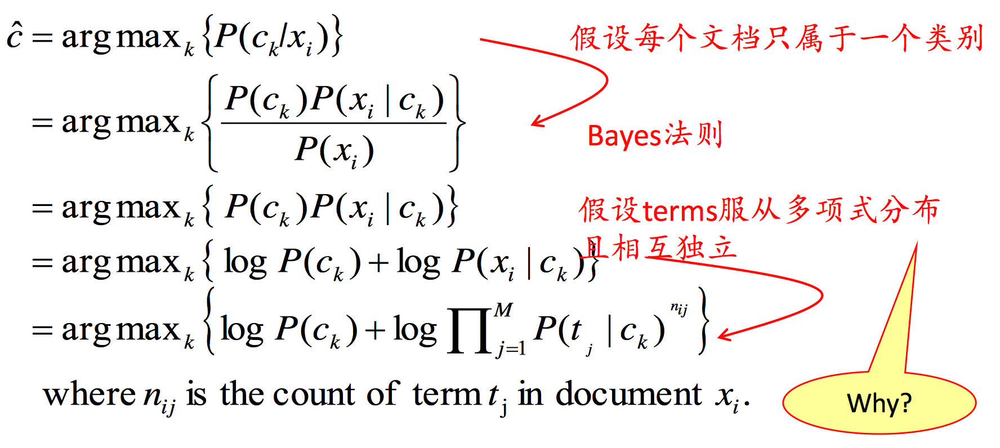

# NLP assignment2 Detect Sentiment Polarity with Naive Bayes

*姓名：王涵 学号：2015211984*

------							
	Keywords: 
	Naive Bayes, Sentiment Analysis
## Problem 1
Generally speaking, sentiment analysis aims to determine the attitude of a document. In this task, the goal is to be able to tell whether the review is positive or negative.

In this experiment, to solve this two-class classification problem, the thought is to deploy a **Naive Bayes Model** to compute the posterior probablities of words shows in the dataset.

## Usage
### Software Requirement
~~~
python 2.7.6
numpy=1.12
nltk=3.2
~~~

### Source Code
[naive-bayes.py](naive_bayes.py)

## Algorithms and Models

Naive Bayes is a prbablity-based model to classify the dataset. The model is based on Bayes' Theorem.

In training step, the goal is to compute the probablity that word wi's conditional probablity of show in cj type of text.

In this model,C={ci|i∈N}={Pos,Neg}, the goal is to compute **P(wi|Pos)** and **P(wi|Neg)**

The probablities is generated by **Maximum Likelihood Estimation**.

While in test step, probablity for each class is computed respectivaly to find the class with largest probablity. In doing so, the class of a test sample is labeled.

## Preproccessing

* Remove all the stopwords. (Proposed in nltk corpus)
* Skip the word that doesn't show up in training step.

## Perfomances

To test the accuracy on this model, I pull out a 5-fold cross-validation.

|   | Acc.(with stopwords) | Acc. (without stopwords) |
|---|----------------------|--------------------------|
| 1 | 77.5328 %            | 77.2983 %                |
| 2 | 77.0637 %            | 76.6885 %                |
| 3 | 78.0018 %            | 76.7354 %                |
| 4 | 76.5947 %            | 76.3133 %                |
| 5 | 76.1949 %            | 75.6794 %                |

## Analysis and Conclusion
From the charts showed above, the model that didn't remove the stopwords is doing slight better. The possible explaination may be that the distribution of stopwords on this dataset is uneven.

Overall, the accuracy on this dataset is slightly higher than what is expected to see with Naive Bayes Model by several paper. It may because the preprocessing method is working. And it helps with the classification.

The part-of-speech tags and the polarity of words are not used in this experiment.

