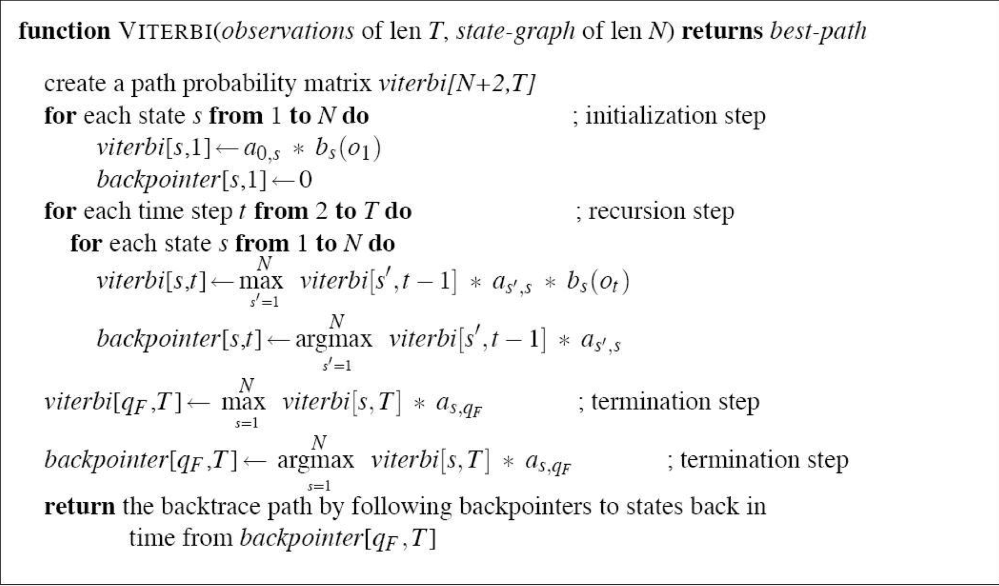

# NLP assignment2 Part-of-speech Tagging using HMM

*姓名：王涵 学号：2015211984*

------							
	Keywords: 
	Hidden Markov Model, POS, Part-of-Speech Tagging
##Problem 1
###Intro: 

Design a sequence learning method to predicate a POS tags for each word in sentences.
 
Using 80% of the dataset as the training set and 20% as the test set.

##Datasets
In this assignment, we select two datasets:

* UPENN Treebank 5290.  

>[treebank.5290.train](treebank.5290.train)     
>[treebank.5290.test](treebank.5290.test)

* One month of Chinese daily tagged under Peking Univ. Standard

>[PKU dataset](dataset.txt)

##Usage
~~~
python hmm.py [--dataset treebank|pku]
~~~
By default, the program takes pku dataset as input with accuracy output.

##Environment
###Software Requirements
~~~
python 2.7.10  
numpy>=0.9
~~~
###Source Code

 [hmm.py](hmm.py)      

### Data Preprocessing

On the treebank dataset, the word consists of all digits are considered as *number* label, which is replaced with # for both training and test steps.

On the PKU dataset, the word with date and digits are processed seperately to match the tag in both training and test steps.

##Algorithms and Models
In this assignment, I select Hidden Markov Model to solve the POS problem.  
 
~~~
HMM={States,Observations,St_prob_distrib,State_trans_prob,Emission_prob}
~~~  

Hidden Markov Model consists of two sequences: The hidden states sequence and the observation sequence.    
The part-of-speech tag of words in sentences can interpreted as the hidden states sequence. The sequence of words in a sentence can be interpreted as the observation sequence. Both seqences can be accessed in the traning dataset.
     
The **matrix of state transition probablity distribution A** and the **matrix of emission probablity distribution B** can be extracted from the training data using **Maximum Likelihood Estimation** to compute the probablity.

In that way, the problem of solving the POS problem tranfered to decoding problem of a hidden markov model. 

Then Viterbi Algorithm is applied to compute the best predicted seqence of hidden states.

## Perfomances and Benchmarks
###On dataset Treebank.5290.   
Test Accuracy: 89.2363 %.   
Training Accuracy: 95.3124 %

###On dataset PKU:
For the training set and test set are randomly selected.

|   	| Training Accuracy 	| Test Accuracy 	|
|---	|-------------------	|---------------	|
| 1 	| 96.2624 %         	| 93.2424 %     	|
| 2 	| 95.8923 %         	| 93.0331 %     	|
| 3 	| 95.4772 %         	| 92.9878 %     	|
| 4 	| 96.1209 %         	| 93.2322 %     	|
| 5 	| 96.0122 %         	| 93.2055 %     	|

##Result Analysis
We can detect the slightly difference in accuracy in two dataset. Firstly, the treebank dataset is an English dataset for the words in the dataset is segmented by detecting space in between words, the ambiguity in a language is unavoidable. While in the PKU dataset the word are already segmented to do part-of-speech tagging, the ambiguity of word reduces to some extent. It helps explain why the same method is doing better with a Chinese dataset than an English one.

##Conclusion
The Hidden Markov Model is very suitable for part-of-speech tagging problem. The accuracy on both dataset is absolutely acceptable. To import the lexicon of some words to do part-of-speech tagging may be of assistance to further increase the accuracy.

